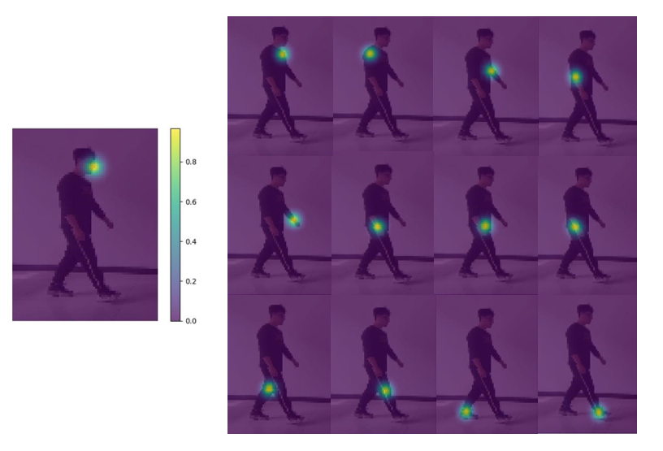
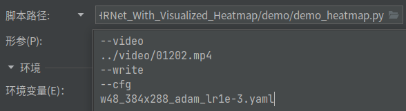
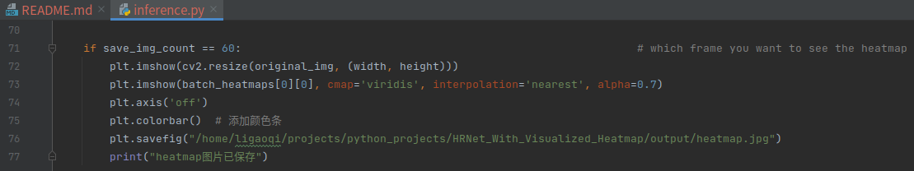

# HRNet with Visualized Heatmap

### Visualized Result



## Introduction
This is a repo generating HRNet visualized heatmap from a single video.

## Environment
The code is developed using python 3.9 on Ubuntu 18.04 and using an NVIDIA GeForce 3060 GPU.

## Quick start
### Installation
1. Create conda env
   ```
   conda create -n you-env-name python=3.9
   ```
2. Install [Pytorch](https://pytorch.org/get-started/locally/):
   ```
   pip install torch==1.11.0+cu113 torchvision==0.12.0+cu113 torchaudio==0.11.0 --extra-index-url https://download.pytorch.org/whl/cu113
   ```
3. Clone this repo, and we call the root directory as ${ROOT}.


4. Install dependencies:
   ```
   pip install -r requirements.txt
   ```
5. Install [COCOAPI](https://github.com/cocodataset/cocoapi):
   ```
   pip install pycocotools
   ```
6. Init heatmap output dir:

   ```
   mkdir output
   ```

   Your dir tree should look like this:

   ```
   ${ROOT}
   |-- data
   |-- experiments
   |-- figure
   |-- lib
   |-- models
   |-- output
   |-- tools
   |-- video
   |-- README.md
   |-- requirements.txt
   ```

7. Download HRNet pretrained models from model zoo([GoogleDrive](https://drive.google.com/drive/folders/1hOTihvbyIxsm5ygDpbUuJ7O_tzv4oXjC?usp=sharing) or [OneDrive](https://1drv.ms/f/s!AhIXJn_J-blW231MH2krnmLq5kkQ))
   ```
   ${ROOT}
    `-- models
        `-- pytorch
            |-- pose_coco
            |   |-- pose_hrnet_w32_384x288.pth
            |   `--pose_hrnet_w48_384x288.pth
   ```

### Run the script

1. Configure the python run script and the runtime parameters in [Pycharm](https://www.jetbrains.com/pycharm/)





2. Get the result
```
${ROOT}/output/heatmap.jpg
```

### Customize the results you want
Modify the code in ${ROOT}/lib/core/inference.py from line 71 to line 77

```
save_img_count  -->  which frame of the video you want to see the heatmap

The shape of batch_heatmaps is like (1, 17, 96, 72) in single person scenario

17            -->  the index of keypoints
(96, 72)  -->  the size of heatmap

1. You can change the 'keypoints_index' in batch_heatmaps[0][keypoints_index] to get the certain keypoint heatmap you want.

2. You can also use matplotlib to generate personalized image.
```




### Acknowledgments
```
@inproceedings{sun2019deep,
  title={Deep High-Resolution Representation Learning for Human Pose Estimation},
  author={Sun, Ke and Xiao, Bin and Liu, Dong and Wang, Jingdong},
  booktitle={CVPR},
  year={2019}
}

@inproceedings{xiao2018simple,
    author={Xiao, Bin and Wu, Haiping and Wei, Yichen},
    title={Simple Baselines for Human Pose Estimation and Tracking},
    booktitle = {European Conference on Computer Vision (ECCV)},
    year = {2018}
}

@article{WangSCJDZLMTWLX19,
  title={Deep High-Resolution Representation Learning for Visual Recognition},
  author={Jingdong Wang and Ke Sun and Tianheng Cheng and 
          Borui Jiang and Chaorui Deng and Yang Zhao and Dong Liu and Yadong Mu and 
          Mingkui Tan and Xinggang Wang and Wenyu Liu and Bin Xiao},
  journal   = {TPAMI}
  year={2019}
}
```

### Contact
```
ligaoqi02@gmail.com
```
